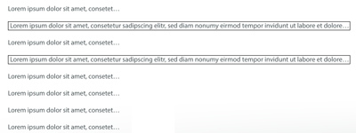

UILabelOverlay
==============

UILabel subclass to show an overlay view with the whole text

Idea: Maybe you have a UILabel that is truncated, but you want to show the complete text when clicking on the UILabel.
This implementation is adding a UITapGestureRecognizer and is showing a overlay UIView with the complete text of the UILabel.

**Attention**: The maximum width of the overlay has to be defined with `maxWidth`. Maybe additional implementations have to be done (maybe provide more than one line). An automatic truncating would be nice.

